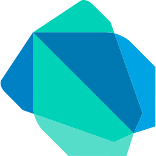
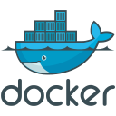

<h1 align="center">Hi👋, I'm Lorex-Tech</h1>

Senior Full Stack Developer

## Main Languages

## Front-End Technologies

## Back-End Technologies

## Mobile Development

## Databases

## DevOps

## Tool & Frameworks

## Version Control

